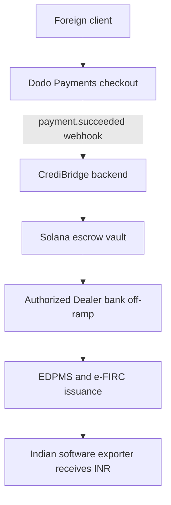

# CrediBridge

CrediBridge is an intelligent payment orchestration gateway for Indian software exporters. It captures foreign payments through a compliant Merchant of Record, bridges settlement over Solana, and triggers Authorized Dealer bank off-ramps so exporters receive INR quickly with a valid e-FIRC.

This repository implements the build plan in [.agent/CREDOBRIDGE_PLAN.md](.agent/CREDOBRIDGE_PLAN.md): a Fastify backend with an in-memory store and a documented Postgres schema ([apps/backend](apps/backend)), a Next.js dashboard ([apps/frontend](apps/frontend)), an Anchor Token-2022 escrow program ([programs/escrow](programs/escrow)), and devnet seed and end-to-end simulation scripts ([scripts/](scripts/)). The MVP runs offline (no Dodo or Solana credentials required) and falls forward to real integrations when env vars are populated.

## Table of contents
- Problem
- Proposed solution
- Goals and non-goals
- Workflow
- Payment lifecycle
- Planned architecture
- Data model (planned)
- Planned API surface
- Reliability and observability
- Security and compliance
- Planned tech stack
- MVP scope (planned)
- Repository structure (planned)
- Roadmap
- References

## Problem
Indian SaaS companies, freelancers, and agencies need fast, low-cost international payments without losing RBI/FEMA compliance. Stablecoin-only flows are fast but cannot generate an e-FIRC, which is required for GST zero-rating, DGFT benefits, and audit readiness.

## Proposed solution
CrediBridge combines:
- Dodo Payments as Merchant of Record with regulatory metadata injection
- A Solana escrow hop for fast, auditable settlement
- Authorized Dealer bank off-ramp to issue an e-FIRC

## Goals and non-goals
Goals:
- Reduce settlement time from days to minutes without breaking compliance
- Preserve an auditable record of cross-border settlement on-chain
- Automate e-FIRC issuance through AD bank integration

Non-goals (for MVP):
- Form 15CA/15CB generation
- Real EDPMS filing
- Multi-currency support beyond USD
- Mobile app

## Workflow


## Payment lifecycle
Planned status progression for a payment session:
- `pending` -> `dodo_captured` -> `solana_transiting` -> `offramped` -> `efirc_generated`

## Planned architecture
Core components and responsibilities:
- Dodo Payments checkout with metadata for purpose code, GST, PAN, and EDPMS reference
- Fastify backend for webhook verification, idempotency, and async processing
- Solana escrow program (Anchor) to receive and release USDC
- Helius WebSocket listener for transaction finality
- Mock AD bank API for MVP; real integration post-hackathon
- e-FIRC PDF generator for demo

## Data model (planned)
```typescript
interface Vendor {
  id: string;
  name: string;
  gst_number: string;
  pan_number: string;
  ad_bank_account: string;
  solana_wallet: string;
  purpose_code: 'S1007' | 'S0802' | 'S0899';
  edpms_irm_number?: string;
}

interface PaymentSession {
  id: string;
  vendor_id: string;
  dodo_session_id: string;
  amount_usd: number;
  regulatory_metadata: {
    purpose_code: string;
    gst_number: string;
    export_classification: string;
    invoice_number: string;
  };
  status: 'pending' | 'dodo_captured' | 'solana_transiting' | 'offramped' | 'efirc_generated';
  solana_tx_signature?: string;
  efirc_document_url?: string;
}
```

## Planned API surface
Backend endpoints expected for the MVP:
- `POST /api/sessions/create` create a Dodo checkout session with injected metadata
- `POST /webhooks/dodo` verify webhook signatures and enqueue processing
- `POST /api/vendors` create vendor profiles and compliance details
- `GET /api/sessions/:id` retrieve session status and e-FIRC link

## Reliability and observability
- HMAC verification on all Dodo webhooks
- Idempotency guard using webhook IDs
- Async processing with retry and backoff
- Dead-letter handling for failed events

## Security and compliance
- Dodo Payments operates as Merchant of Record to satisfy PA-CB requirements
- Purpose codes are injected at payment capture for FEMA compliance
- AD bank off-ramp issues e-FIRC for GST and audit requirements
- Secrets stored in environment variables; never logged

## Planned tech stack
- Backend: Node.js, TypeScript, Fastify, PostgreSQL, Redis, BullMQ
- Solana: Anchor, @solana/web3.js, @solana/spl-token, Helius RPC
- Frontend: Next.js, Tailwind CSS, shadcn/ui

## MVP scope (planned)
| Feature | Priority |
|---|---|
| Vendor onboarding (GST, PAN, purpose code) | P0 |
| Dodo checkout session creation with metadata | P0 |
| Webhook receiver (HMAC-verified, idempotent) | P0 |
| Solana USDC escrow vault (devnet) | P0 |
| Mock AD bank off-ramp | P0 |
| e-FIRC PDF generation | P0 |
| Vendor dashboard | P1 |
| FX savings calculator | P1 |

## Repository structure (planned)
Planned monorepo layout (from [.agent/CREDOBRIDGE_PLAN.md](.agent/CREDOBRIDGE_PLAN.md)):

```
credbridge/
|-- apps/
|   |-- backend/
|   |   |-- src/
|   |   |   |-- routes/
|   |   |   |   |-- sessions.ts
|   |   |   |   |-- webhooks.ts
|   |   |   |   `-- vendors.ts
|   |   |   |-- services/
|   |   |   |   |-- dodo.ts
|   |   |   |   |-- solana.ts
|   |   |   |   |-- offramp.ts
|   |   |   |   `-- efirc.ts
|   |   |   |-- queues/
|   |   |   |   `-- payment.ts
|   |   |   `-- db/
|   |   |       `-- schema.ts
|   |   `-- package.json
|   `-- frontend/
|       |-- app/
|       |   |-- dashboard/
|       |   |   |-- page.tsx
|       |   |   `-- onboard/
|       |   |       `-- page.tsx
|       |   `-- api/
|       |       `-- sessions/
|       |           `-- route.ts
|       `-- package.json
|-- programs/
|   `-- escrow/
|       |-- src/
|       |   `-- lib.rs
|       |-- tests/
|       |   `-- escrow.ts
|       `-- Anchor.toml
|-- docs/
|   |-- architecture.png
|   |-- demo-script.md
|   `-- regulatory-primer.md
|-- scripts/
|   |-- seed-devnet.ts
|   `-- simulate-payment.ts
|-- .env.example
|-- README.md
`-- package.json
```

## Roadmap
Post-hackathon targets include:
- Real AD bank integration via Skydo or Karbon-style APIs
- Form 15CA/15CB automation
- Multi-currency support and vendor payout batching

## Running the MVP

```bash
# Backend (Fastify, in-memory store, no infra required)
cd apps/backend
npm install
npm run dev          # http://localhost:3001
npm test             # 21 tests across webhook, queue, settlement, e-FIRC

# Frontend (Next.js dashboard)
cd apps/frontend
npm install
npm run dev          # http://localhost:3000

# End-to-end simulation (requires the backend running)
DODO_WEBHOOK_SECRET=whsec_test tsx scripts/simulate-payment.ts
```

The simulation script creates a vendor, opens a payment session, sends a signed
synthetic Dodo webhook, polls until the session reaches `efirc_generated`, and
saves the e-FIRC PDF locally.

### Devnet escrow program

```bash
cd programs/escrow
anchor build
tsx ../../scripts/seed-devnet.ts
anchor test
```

## Status
Implemented. See [.agent/CREDOBRIDGE_PLAN.md](.agent/CREDOBRIDGE_PLAN.md) for the full build plan, demo script, and risk analysis.

## References
- Dodo Payments docs: https://docs.dodopayments.com/introduction
- Dodo webhooks: https://docs.dodopayments.com/developer-resources/webhooks
- Solana token extensions: https://solana.com/solutions/token-extensions
- Helius RPC: https://docs.helius.dev
- Anchor framework: https://www.anchor-lang.com
- e-FIRC overview: https://cleartax.in/s/foreign-inward-remittance-certificate
- RBI PA-CB directions (Sept 2025): https://www.rbi.org.in
