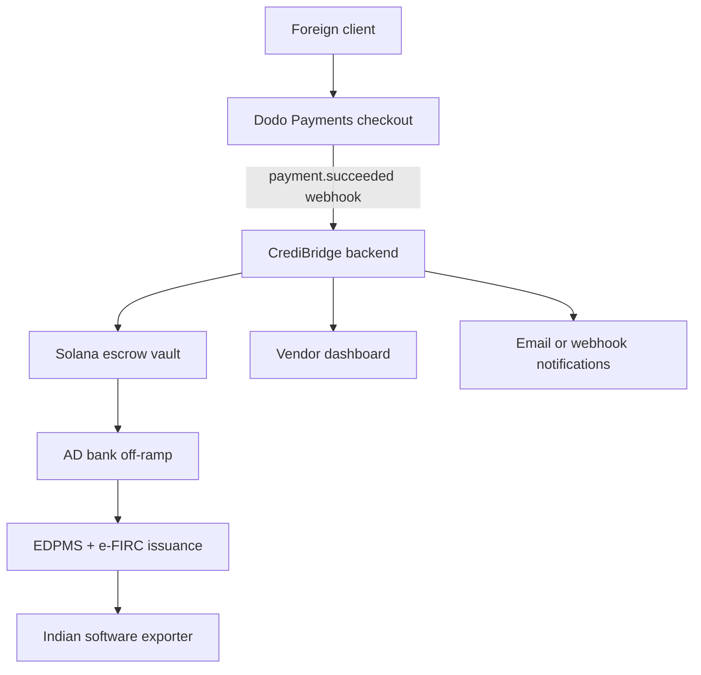

# Architecture Diagram

This diagram can be exported to an image for the README if needed.

Notes:
- Dodo captures payment and sends signed webhooks.
- Metadata injected at capture includes purpose code, GSTIN, PAN, and invoice number.
- Solana settlement provides an auditable on-chain hop before fiat off-ramp.
- AD bank off-ramp issues the e-FIRC used for GST and audit compliance.
